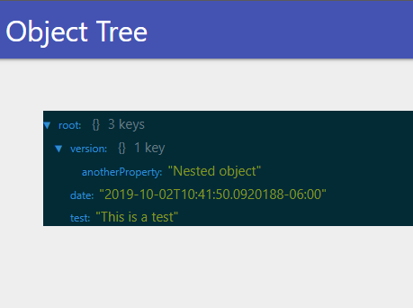

# ud-objecttree

Object tree component for [Universal Dashboard](https://ironmansoftware.com/powershell-universal-dashboard)

# Installation 

```
Install-Module UniversalDashboard.ObjectTree 
```

# Example 

```
$Dashboard = New-UDDashboard -Title "Object Tree" -Content {
    $Data = @{
        Test = "This is a test"
        Date = Get-Date 
        Version = @{
            AnotherProperty = "Nested object"
        }
    }

    New-UDObjectTree -Object $Data
}

Start-UDDashboard -Dashboard $Dashboard -Port 10000 -Force
```


